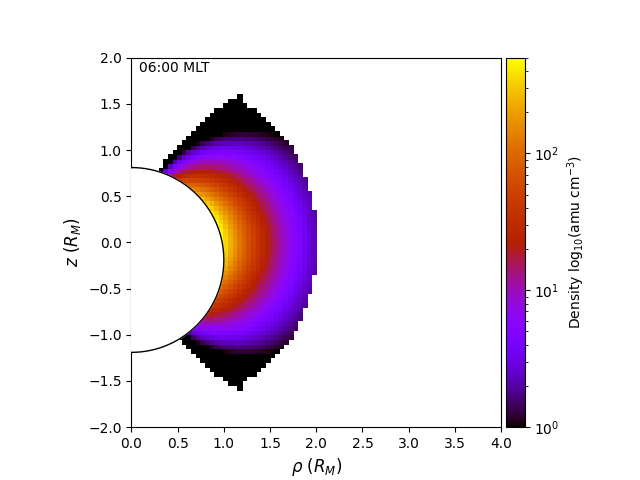

# HermeanFLRModel

Dayside plasma mass density model for Mercury based on field line resonances (FLRs). The FLRs used to create this model were found using MESSENGER magnetometer data as described by James et al., 2019.

## Installation

### Option 1: Install from Python wheel package

Download the latest release, then install using terminal:

```bash
pip3 install HermeanFLRModel-x.y.z-py3-none-any.whl --user
```

where `x.y.z` should be replaced with the version string.

### Option 2: Download and build latest version

Clone this repo:

```bash
git clone https://github.com/mattkjames7/HermeanFLRModel.git
```

Build the package:

```bash
cd HermeanFLRModel
python3 setup.py bdist_wheel
```

Install it:

```bash
pip3 install dist/HermeanFLRModel-x.y.z-py3-none-any.whl --user
```

## Usage

Use of the model is fairly simple, start by importing the module and creating an instance of the `Model` object:

```python
import HermeanFLRModel as hflr

model = hflr.Model(Alpha,Coord='MSM')
```

where `Alpha` is the power law index (from 0 to 6), or the string `'variable'` and `Coord` denotes the coordinate system to use. The variable alpha corresponds to curves fitted to the results in table 2 of James et al., 2019, where the exponent and the equatorial plasma mass density are a function of the *L*-shell of the field line. The accepted coordinate systems are `'MSM'` (Mercury Solar Magnetospheric), `'MSO'` (Mercury Solar Orbital) and `'FLC'` (field line coordinates). Both MSM and MSO are Cartesian coordinate systems, with *x* directed towards the Sun, *z* along the planetary rotation axis and *y* completing the right-handed set pointing approximately in the opposite direction to Mercury's orbit. Field line coordinates are simply the *L* shell (radial distance of the field line equatorial footprint), MLT at the magnetic equatorial plane and  *R<sub>norm</sub>* which is the radius of a given point along the field line, divided by the maximum *R* along the field line at the equator. MSO and MSM coordinates are converted to FLC coordinates in order to calculate the model density by using the KT17 magnetic field model (Korth et al., 2017).

Once the model object is created, get some densities:

```python
#create input coordinate(s)
x = np.zeros(6)
y = np.array([1.0,1.2,1.4,1.6,1.8,2.0])
z = np.zeros(6)

#call model Calc() function
rho = model.Calc(x,y,z)
```

A slice of the magnetosphere may also be plotted:

```python
#select magnetic local time and alpha
MLT = 6.0
Alpha = 3.0

#plot it
ax = hflr.PlotModelSlice(MLT,Alpha)
```

which should produce a plot like this:



## References

Korth, H., Johnson, C. L., Philpott, L., Tsyganenko, N. A., & Anderson, B. J. (2017). A dynamic model of Mercury's magnetospheric magnetic field. *Geophysical Research Letters*, 44, 10,147– 10,154. https://doi.org/10.1002/2017GL074699

James, M. K., Imber, S. M., Yeoman, T. K., & Bunce, E. J. (2019). Field line resonance in the Hermean magnetosphere: Structure and implications for plasma distribution. *Journal of Geophysical Research: Space Physics*, 124, 211– 228. https://doi.org/10.1029/2018JA025920
